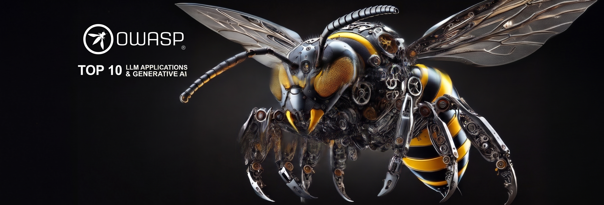

  

# GenAI-LLM-Top10

Companion repository to the OWASP Top 10 for Large Language Model Applications, maintained under the [GenAI Security Project](https://github.com/GenAI-Security-Project) org.

# OWASP Top 10 for Large Language Model Applications

Welcome to the official repository for the OWASP Top 10 for Large Language Model Applications!

## About This Repository

This repository contains the OWASP Top 10 for Large Language Model Applications, which is now housed under the comprehensive **OWASP GenAI Security Project**. The OWASP GenAI Security Project is a global, open-source initiative dedicated to identifying, mitigating, and documenting security and safety risks associated with generative AI technologies.

**Visit our main project site:** [genai.owasp.org](https://genai.owasp.org)

## Overview and Audience 🗣️

The OWASP Top 10 for Large Language Model Applications is a standard awareness document for developers and web application security. It represents a broad consensus about the most critical security risks to Large Language Model (LLM) applications. There are other ongoing frameworks both inside and outside of OWASP that are not to be confused with this project and is currently scoped towards only LLM Application Security.

Our primary audience is developers, data scientists, and security experts tasked with designing and building applications and plugins leveraging LLM technologies. We aim to provide practical, actionable, and concise security guidance to help these professionals navigate the complex and evolving terrain of LLM application security.

## Key Focus 📖

The primary aim of this project is to provide a comprehensible and adoptable guide to navigate the potential security risks in LLM applications. Our Top 10 list serves as a starting point for developers and security professionals who are new to this domain, and as a reference for those who are more experienced.

## Mission Statement 🚀

Our mission is to make application security visible, so that people and organizations can make informed decisions about application security risks related to LLMs. While our list shares DNA with vulnerability types found in other OWASP Top 10 lists, we do not simply reiterate these vulnerabilities. Instead, we delve into these vulnerabilities' unique implications when encountered in applications utilizing LLMs.

Our goal is to bridge the divide between general application security principles and the specific challenges posed by LLMs. The group's goals include exploring how conventional vulnerabilities may pose different risks or be exploited in novel ways within LLMs and how developers must adapt traditional remediation strategies for applications utilizing LLMs.

## Project Documents 📄

- [**OWASP Top 10 for LLM Applications Charter**](./OWASP%20Top%2010%20for%20LLM%20Applications%20Charter.md) — mission, scope, governance, and operating principles for the project.
- [**Sprint Plan and Project Timeline — 2026**](./Sprint%20Plan%20and%20Project%20Timeline%20OWASP%20Top%2010%20for%20LLM%20%282026%29.md) — sprint structure and milestone timeline for the 2026 release cycle.

## Contribution 👋

The first version of this list was contributed by Steve Wilson of Contrast Security. We encourage the community to contribute and help improve the project. If you have any suggestions, feedback or want to help improve the list, feel free to open an issue or send a pull request.

For contributors working on the **2026 cycle**, see the track-specific guide in [`2026/CONTRIBUTING.md`](./2026/CONTRIBUTING.md).

We have a working group channel on the [OWASP Slack](https://owasp.org/slack/invite), so please sign up and then join us on the #project-top10-llm channel.

**Learn how to contribute:** [https://genai.owasp.org/contribute/](https://genai.owasp.org/contribute/)

## License

This project is licensed under the terms of the [Creative Commons Attribution-ShareAlike 4.0 International License](https://creativecommons.org/licenses/by-sa/4.0/).

## Support OWASP!

<picture>
  <source
    media="(prefers-color-scheme: dark)"
    srcset="
      https://api.star-history.com/svg?repos=OWASP/www-project-top-10-for-large-language-model-applications&type=Date&theme=dark&legend=top-left
    "
  />
  <source
    media="(prefers-color-scheme: light)"
    srcset="
      https://api.star-history.com/svg?repos=OWASP/www-project-top-10-for-large-language-model-applications&type=Date&legend=top-left
    "
  />
  
</picture>
