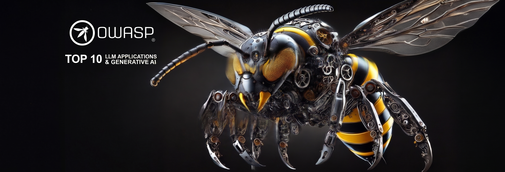

  

# OWASP Top 10 for Large Language Model Applications

> [!IMPORTANT]
> **Current release: 2026 — published August 4, 2026.**
>
> [Get the 2026 publication](https://genai.owasp.org/resource/owasp-genai-llm-top-10-2026/) · [Read the canonical source](./2026/final/) · [Report a correction](https://github.com/GenAI-Security-Project/GenAI-LLM-Top10/issues/new?template=release-errata.yml)

This is the official source repository for the **OWASP Top 10 for Large Language Model Applications**, maintained as a core initiative of the [OWASP GenAI Security Project](https://genai.owasp.org/).

The Top 10 is a community-developed awareness document for developers, architects, data scientists, security practitioners, and organizations building or operating applications that use large language models.

## 2026 Release

The 2026 release is complete. The publication combines community judgment with analysis of real-world incidents and updates the ordering, scope, examples, mitigations, and framework mappings across the list.

| Resource | Location |
|---|---|
| Official publication | [Get the OWASP GenAI LLM Top 10 2026](https://genai.owasp.org/resource/owasp-genai-llm-top-10-2026/) |
| Canonical Markdown source | [`2026/final/`](./2026/final/) |
| Release overview | [`2026/README.md`](./2026/README.md) |
| Previous release | [`2025/`](./2025/) |

### OWASP GenAI LLM Top 10 2026

1. **LLM01:2026 Prompt Injection**
2. **LLM02:2026 Sensitive Information Disclosure**
3. **LLM03:2026 Excessive Agency**
4. **LLM04:2026 Supply Chain**
5. **LLM05:2026 Data and Model Poisoning**
6. **LLM06:2026 Unbounded Consumption**
7. **LLM07:2026 Misinformation**
8. **LLM08:2026 Hidden Context Exposure**
9. **LLM09:2026 Vector and Embedding Weaknesses**
10. **LLM10:2026 Improper Output Handling**

## Repository Layout

* [`2026/final/`](./2026/final/) — canonical source for the published 2026 release
* [`2026/working/`](./2026/working/) — historical working files and release-cycle tooling
* [`2025/`](./2025/) — source for the previous release
* [`documentation/style/`](./documentation/style/) — editorial and branding guidance
* [Project charter](./OWASP%20Top%2010%20for%20LLM%20Applications%20Charter.md) — mission, scope, governance, and operating principles

The [2026 sprint plan](./Sprint%20Plan%20and%20Project%20Timeline%20OWASP%20Top%2010%20for%20LLM%20%282026%29.md) and [`2026/working/CONTRIBUTING.md`](./2026/working/CONTRIBUTING.md) are retained as records of the completed release process. They are not the current contribution workflow.

## Contributing

Post-release corrections and improvements are welcome. Use the [2026 release errata form](https://github.com/GenAI-Security-Project/GenAI-LLM-Top10/issues/new?template=release-errata.yml) for specific errors, broken links, or source/publication mismatches. Use the [release feedback form](https://github.com/GenAI-Security-Project/GenAI-LLM-Top10/issues/new?template=release-feedback.yml) for broader feedback or proposals for a future cycle.

> [!IMPORTANT]
> All changes to this repository must be made through a pull request. Direct pushes to `main` are blocked by branch protection.

We have a working group channel on [OWASP Slack](https://owasp.org/slack/invite): `#team-genai-top-10-llm`.

For the broader project contribution process, visit [genai.owasp.org/contribute](https://genai.owasp.org/contribute/).

## Citing this work

The 2026 edition is archived on Zenodo. Cite the concept DOI, which always
resolves to the newest edition:

> OWASP GenAI Security Project. (2026). *OWASP Top 10 for Large Language Model
> Applications* (Version 2026). OWASP Foundation.
> <https://doi.org/10.5281/zenodo.22109014>

To cite the 2026 edition specifically rather than the newest, use its version
DOI, [10.5281/zenodo.22109015](https://doi.org/10.5281/zenodo.22109015).
[`CITATION.cff`](./CITATION.cff) carries the same metadata in machine-readable
form, and GitHub renders it under "Cite this repository".

## License

This project is licensed under the [Creative Commons Attribution-ShareAlike 4.0 International License](https://creativecommons.org/licenses/by-sa/4.0/).

## Support OWASP

<picture>
  <source
    media="(prefers-color-scheme: dark)"
    srcset="https://api.star-history.com/svg?repos=GenAI-Security-Project/GenAI-LLM-Top10&type=Date&theme=dark&legend=top-left"
  />
  <source
    media="(prefers-color-scheme: light)"
    srcset="https://api.star-history.com/svg?repos=GenAI-Security-Project/GenAI-LLM-Top10&type=Date&legend=top-left"
  />
  
</picture>
